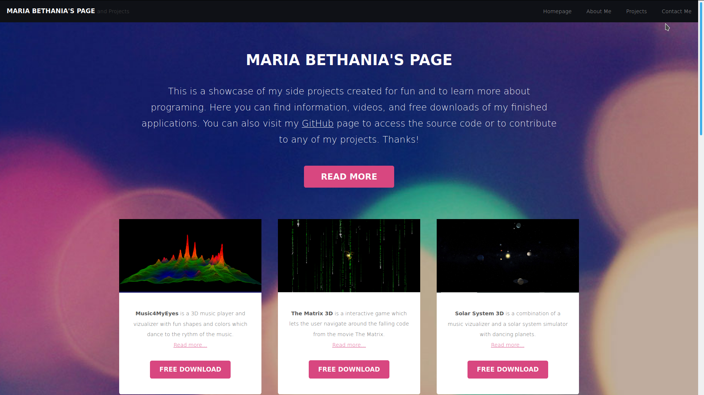

# Bethania Website    
### [https://mariabethania.herokuapp.com/](https://mariabethania.herokuapp.com/) 

Portafolio website for Maria Bethania to showcase her programing projecst. The website has project descriptions with picture previews, video demostrations, and free download of the working apps. This website also has a contact page to send messages to Bethania, and a about me to get to know her better.

The website was created using php and hosted on heroku. The project section can easily be updated by changing information on a json file.

